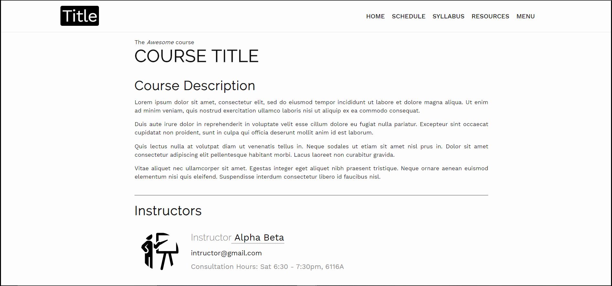

# Orca
A jekyll template for easy creation of course websites! No need to code the messy HTML pages. Just make a few changes in user-friendly syntax, and you'll be good to go.
  

## Why should I use it?
* Simple, elegant and minimalistic design, perfect for your course website.
* Easy to create and you get your website in no time, that too completely free!
* Highly flexible and responsive.
* You can host your site for free on GitHub Pages.

## Template used in:
Checkout:
* [pipaf website][pipaf]

## Quick Setup
For a guide to install Jekyll and build locally, refer [here][jekyll_doc]. Note that this is an optional step, required only if you want to locally build the website. You can actually build and host the website directly on GitHub pages.

## 6 Quick steps :

 ### 1. Using the template 
 Click on the 'Use this template' button above & fill in the repository details. Once the repository is created, clone it & make the changes below to this cloned repository.  

 ### 2. Adding assets
 Add any data files(Lecture slides, notes, assignments ) in the respective subdirectories in `assets` directory. If images are needed, add them directly to assets directory. 
 Resources must be explicitly named with complete file extensions(.pdf, etc).
Note: Please avoid changing directory structure of the root.

 ### 3. Set up header & footer
 In the `_data` directory, go to the `includes` subdirectory's `header.yml` file and make the tabs you want (in existing format). Similarly customize the footer as per your wish.

 ### 4. Adding data in `.yml` files
 For adding data in the HTML pages, make changes in the `.yml` files of corresponding subdirectories of `_data` directory. So, for instance, for adding content to the `Resources.html` page of your website, go to the `resources` subdirectory of `_data` directory. Then, for adding lecture details, go to `lectures.yml`.While adding content, avoid changing the keys/file names. If you have to change the keys, make the changes in the corresponding .HTML files (where it is being used as a key) too. Similarly, add content to all `.yml` files.
 Use basic HTML tags such as `
`, ` `,`<a>`, etc. explicitly while writing HTML code in the `.yml` files for their corresponing roles in HTML files. 
**N.B.** :
* Avoid using double quotes(" ") in `.yml` files. Apostrophes & single inverted commas are fine. If you have to use double quotes, read the method of escape characters from [here][jekyll-qoutes]
* Ensure there is a 'space' character while writing in front of keys of `.yml` files and **indent** (note!) your code as per the format followed in the file.

 ### 5. Creating new pages
 You can create new pages to your website by simply creating `your_title.html` (in root directory itself) and simply adding the front-matter, as shown in `extra.html` file. Do not forget to write the front-matter as the webpage will not render properly without it.

 ### 6. Configure the `config.yml` file
 Fill in the details of `config.yml`. (If you are using GitHub pages to host your website, baseurl is the name of your repository. Also, if you are locally hosting your website(while development), set both url and baseurl to empty string("") ).

And, its done! Your awesome course website is ready! 

P.S.

* To create anything new, carefully use the same format as used in the same file.
* While creating new headings/ sub-headings, all `id` attributes should have values same as heading itself, so as to automatically render it.
* If you want assistance in deploying, [click here][deploy].

## Contributions:
Any constructive feedback or contributions are welcome & highly appreciated.

[jekyll-qoutes]: https://talk.jekyllrb.com/t/how-to-use-single-quote-and-double-quote-as-part-of-title-without-escaping/2705
[website]: https://atharva-chandak.github.io/orca_web_template/
[pipaf]: https://p-paf.github.io/
[deploy]: https://jekyllrb.com/docs/deployment/third-party/
[jekyll_doc]: https://jekyllrb.com/docs/